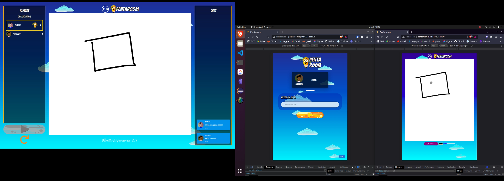

# Pentaroom.io

Pentaroom is a game inspired by Pictionary built with React, NodeJS and SocketIO.

## Technologies
### Backend
- NodeJS

### Frontend
- React

### Communication backend / frontend
- SocketIO